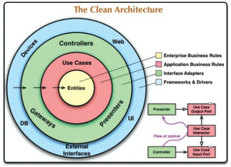

# Clean Architecture

## :pushpin: Description

This repository intents to sumarize the basis of Clean Architecture, to get a quick overview of concepts or a document to come back if you have any doubts.

## :books: Bibliography

* [Clean Architecture - by Robert C. Martin](https://www.goodreads.com/book/show/18043011-clean-architecture)
* [Agile Software Development, Principles, Patterns and Practices - by Robert C. Martin](https://www.goodreads.com/book/show/84985.Agile_Software_Development_Principles_Patterns_and_Practices)
* [Object-Oriented Software Engineering: A Use Case Driven Approach - Ivar Jacobson](https://www.goodreads.com/book/show/296981.Object_Oriented_Software_Engineering)

## :memo: How To Use

* Bottom-up organization, start from first modules if you want to learn from scratch.
* A basic understanding of programming concepts will be helpful but is not needed
* Each module ends with a "Conclusion" section that provides a quick overview, you can jump straight to this if you want a quick reminder and you feel like you already know the topic.
* I strongly recommend further research on the latest and more practical modules, as I don't provide lots of examples but more the theorical basis you need, be proactive.

## :bomb: Table of Contents

* [Introduction](./introduction/README.md)
* [Design and Architecture](./design-and-architecture/README.md)
* [Behavior and Structure](./behavior-and-structure/README.md)
* [Paradigms Overview](./paradigms/README.md)
    * [Structured](./paradigms/structured/README.md)
    * [Object Oriented](./paradigms/object-oriented/README.md)
    * [Functional](./paradigms/functional/README.md)
* [Design Principles](./design-principles/README.md)
    * [SOLID](./design-principles/SOLID/README.md)
        * Single-Responsibility
        * Open-Closed
        * Liskov Substitution
        * Interface Segregation
        * Dependency Inversion
* [Components Principles](./components-principles/README.md)
    * [Components Cohesion](./components-principles/components-cohesion.md)
        * Reuse/Release Equivalence
        * Common Closure
        * Common Reuse
    * [Components Coupling](./components-principles/component-coupling.md)
        * Acyclic Dependencies
        * Tow-down Design
        * Stable Dependencies
        * Stable Abstractions
        * The Main Sequence
* [Architecture](./architecture/README.md)
    * [Independence (decoupling)](./architecture/independence/README.md)
    * [Boundaries and Plugin Architecture](./architecture/boundaries/README.md)
    * [Boundary Anatomy](./architecture/boundary-anatomy/README.md)
    * [Policy and Level](./architecture/policy-level/README.md)
    * [Business Rules, Entities and Use Cases](./architecture/business-rules/README.md)
    * [Screaming Architecture](./architecture/screaming-architecture/README.md)
    * [Clean Architecture](./architecture/clean-architecture/README.md)
    * [Humble Objects](./architecture/humble-objects/README.md)
    * [Partial Boundaries](./architecture/partial-boundaries/README.md)
    * [Layers and Boundaries](./architecture/layers-and-boundaries/README.md)
    * [Main Component](./architecture/main-component/README.md)
    * [Services](./architecture/services/README.md)
    * [Test Boundary](./architecture/test-boundary/README.md)
    * [Clean Embedded Architecture](./architecture/clean-embedded/README.md)
* [Details](./details/README.md)
    * [Database is a Detail](./details/databases/README.md)
    * [Web is a Detail](./details/web/README.md)
    * [Frameworks are Details](./frameworks/README.md)
