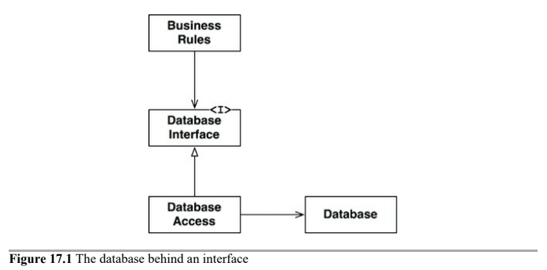
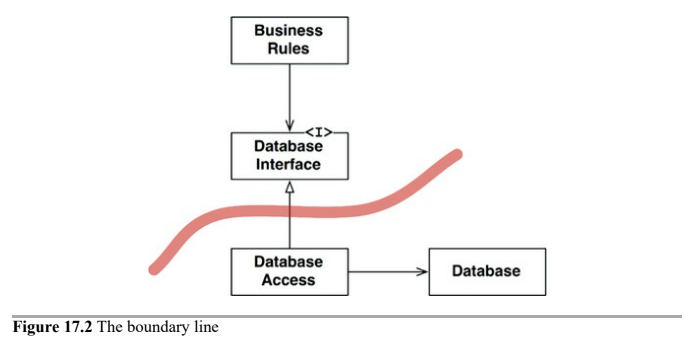
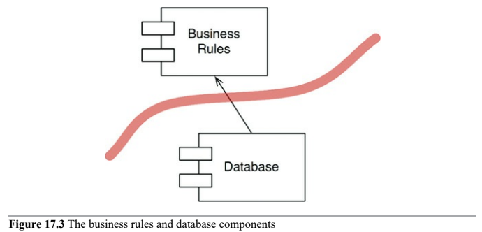
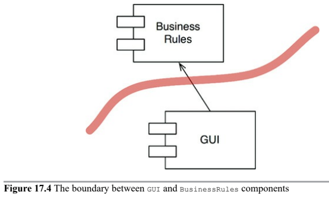
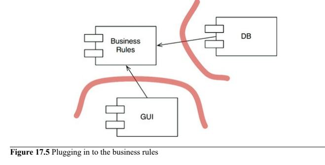
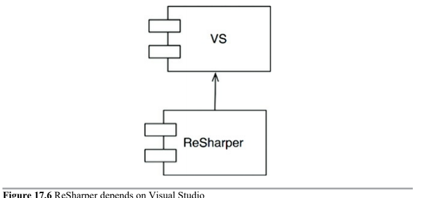

# Boundaries

> Software architecture is the art of drawing lines (_boundaries_).

Boundaries separate software elements from one another, and restrict those on one side from knowing about those on the other. Some of those lines are drawn very early in a project's life. Others are drawn much later.

Those drawn early are for the purposes of __deferring decisions for as long as possible, and of keeping those decisions from polluting the core business logic__.

We want to avoid __coupling, especially to premature decisions__. Decisions that have nothing to do with the business requirements (use cases) of the system. These include decisions about frameworks, databases, web servers, utility libraries, dependency injection, and the like. A good system architecture does not depend on those decisions. A good system architecture allows those decisions to be made at the latest possible moment, without significant impact.

Architects, by making a premature decisions, can multiply the development effort enormously.

## Which lines do you draw and when

You draw lines between things that matter and things that don't.

The GUI doesn't matter to the business rules, so there should be a line between them. The database doesn't matter to the GUI or the business rules, so there should be a line between them too.

The database is a tool that the business rules can use _indirectly_, but don't need to know about the schema or the query language, or any of the other details about the database. All the business needs to know is that there is a set of functions that can be used to fetch or save data. This allows us to put the database behind an interface.

In a real application, there might be many business rule calsses, many database interface classes, and many database access implementations. All of them, though, would follow roughly the same pattern.

The __boundary line is drawn across the inheritance relationship__.

This from the component point of view looks like these:

The `Database` knows about the `BusinessRules`, but the `BusinessRules` do not know about the `Database`. This implies that the `DatabaseInterface` classes live in `BusinessRules` component, while the `DatabaseAccess` classes live in the `Database` component.

We can now see that the `BusinessRules` could use _any_ kind of database.

## Input and Output

Developers and customer fail to realize a critically important principle: _The IO is irrelevant_.

We often think about the behavior of the system in terms of the behavior of the GUI (incluiding GUI).

Consider a video game, for example. Your experience is dominated by the interface: the screen, mouse, buttons, and sounds. You forget that behind that interface there is a model, a sophisticated _set of data structures and functions_ driving it. More importantly, __the model does not need the user interface__. It would happily execute its duties, modeling all the events in the game, without the game ever being displayed on the screen. The user interface does not matter to the model, the business rules.

And so, once again, wee see the `GUI` and the `BusinessRules` components separated by a boundary line. The less relevant component depends on ther more relevant component.

## Plugin Architecture

These decisions create a kind of pattern for the addition of other component. That pattern is the same used by systems that allow third-party plugins.

The history of software development technology is the story of how to conveniently create plugins to estalbish a scalable and maintainable system architecture.

__The core business rules are kept separated from, and independent of, those components that are either optional or that can be implemented in many different forms__.

These replacements might not be trivial. If the initial deployment of our system was web-based, then writing the plugin for a client-server UI could be challenging. It is likely that some of the communications between business rules and new UI would have to be reworked. Even so, __by starting with the presumption of a plugin structure, we have at very least made such a change practical__.

## The Plugin Argument

The source code of [ReSharper](https://www.jetbrains.com/resharper/) depends on the source code of Visual Studio. Thus there is nothing that the ReSharper team can do to disturb the Visual Studio team. But the Visual Studio team could completely disable the ReSharper team if they so desired.

Thats a __deeply asymmetric relationship__, and it is one that we desire to have in our own systems. __We want certain modules to be immune to others__. We don't want changes in one part of the system to cause other unrelated parts of the system to break.

Arranging our systems into a plugin architecture, creates firewalls across which changes cannot propagate.

Boundaries are drawn where there is an _axis of changes_. The components on one side of the boundary change at different rates and for different reasons. The _Single Responsibility Principle_ tells us where to draw our boundaries.

---

# Conclusion 

To draw boundary lines in a software architecture, you first partition the system into components. Some of those components are core business rules, others are plugins that contain necessary functions that are not directly related to the core business.

Then you arrange the code in those such that the arros between them point in one direction (toward the core business).

You should recognize this as an application of the _Dependency Inversion Principle_ and _Stable Abstractions Principle_. Dependency arrows are arranged to point from lower-level details to higher-level abstractions.