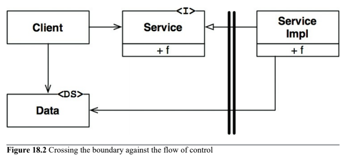

# Boundary Anatomy

* Boundary Crossing
* Dreaded Monolith
* Deployment Components
* Threads
* Local Processes
* Services

> The architecture of a system is defined by a set of software components and the boundaries that separate them.

---

## Boundary Crossing

At runtime, a boundary crossing is nothing more than a function on one side of the boundary calling a function the other side and passing along some data.

## Dreaded Monolith

Simplest and most common of the architectural boundaries __has no strict phyisical representation__. It is simply a __disciplined segregation of functions and data within a single processor and a single address space__.

From a deployment point of view, this amounts to nothing more than a single executable file. The fact that boundaries are not visible during the deployment of a monolith does not mean that they are not present and meaningful. Even when statically linked into a single executable, the ability to indepdently develop and marshal the various components for final assembly is immensely valuable.

Such architectures almost always depend on some kind of _dynamic polymorphism_ to manage their internal dependencies. This is one of the reasons that object-oriented development has become such an important paradigm in recent decades.

When a high-level client needs to invoke a lower-level service, dynamic polymorphism is used to invert the dependency against the flow of control. The runtime dependency opposes the compile-time dependency.

We cross the boundary against the flow of control. Note that all dependencies cross the boundary from right to left, toward the higher-level component. High-level components remain independent of lower-level details.

## Deployment Components

Simplest phyisical representation of an architectural boundary is a dynamically linked library like a .Net DLL, a Java jar file, or a UNIX shared library. Deployment does not involve compilation.

The act of deployment is simply the gathering of these deployabe units together in some convenient form, such as a WAR file, or even just a directory.

Deployment-level components are the same as monoliths. Functions generally all exist in the same processor and address space. The strategies for segregating the components and managing their dependencies are the same.

## Threads

Both monoliths and deployment components can make use of threads. Threads are not architectural boundaries or units of deployment, but rather a way to organize the schedule and order of execution. They may be wholly contained within a component, or spread across many.

## Local Processes

Much stronger phyisical boundary. A local process is typically created from the command line or an equivalent system call. Local processes run in the same processor (or set of processors within a multicore) but run in separate address spaces.

Memory protection generally prevents such processes from sharing memory, although shared memory partitions are often used.

Most often, local processes communicate with each other using sockets, or some other OS communications facility.

The segregation strategy between local processes is the same as for monoliths and deployment components. For local processes this means that the source code of the higher-level processes must not contain names, or phyisical addresses, or registry lookup keys of lower-level processes. Remember that the __the architectural goal is for lower-level processes to be plugins to higher-level processes__.

## Services

Strongest boundary is a service. Services do not depend on their physical location. Two communicating services may, or may not, operate in the same physical processor or multicore. The services assume that all communications take place over the network.

Communications at this level must deal with high levels of latency.

Same rules apply to services as apply to local processes. Lower-level services should "plug-in" to higher-level services. The source code of higher-level services must not contain any specific phyisical knowledge (e.g., a URI) of any lower-level service.

# Conclusion

Most systems, other than monoliths, use more than one boundary strategy. A system that makes use of service boundaries may also have some local process boundaries. A service, or a local process, will almost certainly be either a monolith composed of source code components or a set of dynamically linked deployment components.