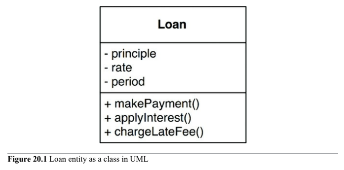
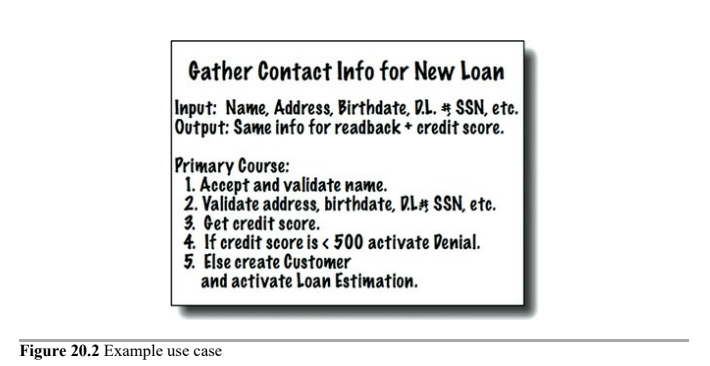

# Business Rules

> Business rules are rules or procedures that make or save the business money.

These roules would make or save the business money, irrespective of whether they were implemented on a computer.

* Entities
    * Critical Business Rules
    * Critical Business Data
* Use Cases
* Request and Response Models

Critical rules and critical data are inextricably bound, so they are a good candidate for an object. We'll call this kind of object an _Entity_.

#### Critical Business Rules

They are critical to the business itself, and would exist even if there was no system to automate them.

For example, a bank's loan interest.

#### Critical Business Data

_Critical Business Rules_ usually require some data to work with. This data would exist even if the system were not automated.

For example, our loan requires a loan balance, an interest rate, and a payment schedule.

## Entities

An _Entity_ is an object within our computer system that __embodies a small set of Critical Business Rules operating on Critical Business Data__.

The _Entity_ object either contains the _Critical Business Data_ or has very easy access to that data.

The interface of the _Entity_ consists of the functions that implement the _Critical Business Rules_ that operate on that data.

For example, our Loan entity might look like as a class in UML. It has three pieces of _Critical Business Data_, and presents three related _Critical Business Rules_ at its interfaces.

When we create this kind of class, we are gathering together the software that implements a concept that is critical to the business, and separating it from every other concern in the automated system we are building. __The Entity is mure business and nothing else__.

> You don't need to use an object-oriented language to create an Entity.

## Use Cases

Not all business rules are as pure as Entities. Some business rules make or save money for the business by defining and constraining the way that an _automated_ system operates. These rules would not be used in a manual environment, because they make sense only as part of an automated system.

A use case is a __description of the way that an automated system is used__. It specifies the input to be provided by the user, the output to be returned to the user, and the processing steps involved in producing that output. A use case __describes the _application-specific_ business rules as opposed to the _Critical Business Rules_ within Entities__.

Use cases contain the __rules that specify how and when the _Critical Business Rules_ within the Entities are invoked__.

> Use cases control the dance of the Entities.

Use cases do not describe how the system appears to the user. How the data gets in and out of the system is irrelevant to the use cases.

A Use Case __is an object__. It has one or more functions that implement the application-specific business rules. It also has data elements that include the input data, the output data, and the references to the appropriate Entities with which it interacts.

__Entities have no knowledge of the use cases that control them__. This is another example of the direction of the dependencies following the _Depending Inversion Principle_. High-level components, such as Entities, know nothing of lower-level components, such as use cases. Instead, the lower-level use cases know about the higher-level entities.

Why are Use Cases lower level than Entities? Because use cases are specific to a single application and, therefore, closer to the inputs and outputs of that system. Entities are generalizations that can be used in many different applications, so they are farther from the inputs and outputs of the system.

#### Example Use Case

For example, imagine an application that is used by bank officers to create a new loan. The bank may decide that it does not want the loan officers to offer loan payment estimates until they have first gathered, and validated, contact information and ensured that the candidate's credit score is 500 or higher. For this reason, the bank may specify that the system will not proceed to the payment estimation screen until the contact information screen has been filled out and verified, and the credit score has been confirmed to be greater than the cutoff.

This is a __use case__.

Notice the last line contians a reference to a Customer entity, which contains the _Critical Business Rules_ that govern the relationship between the bank and its customers.

---

## Request and Response Models

Use cases expect input data, and they produce output data. However, a _well-formed use case object should have no inkling about the way that data is communicated to the user, or to any other component__.

The use case class __accepts simple request data structures for its input, and returns simple response data structures as its output__. These data structures are not dependent on anything.

This lack of dependencies is critical.

You might be tempted to have these data structures contain references to Entity objects. You might think this makes sense because the Entities and the request/response models share so much data. Avoid this temptation! The purpose of these two objects is very different. Over time they will change for very different reasons, so tying them together in any way violates the _Common Closure and Single Responsibility Principle_.

---

# Conclusion

Business rules are the reason a software system exist. They should remain isolated from baser concerns such as the UI or database used. They should be the heart of the system, with lesser concerns being plugged in to them.

The business rules should be the most independent and reusable code in the system.