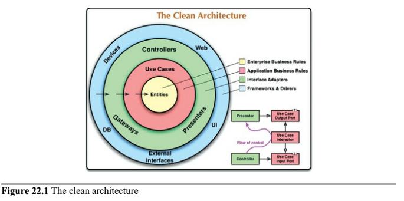

# Clean Architecture

All architectures have the same objective, which is the __separation of concerns__. They all achieve this separation by __dividing the software into layers__.

Most have the following characteristics:

* Independent of frameworks
* Testable
* Independent of the UI
* Independent of the UI
* Independent of any external agency

Let's pay atention to the following:
* Dependency Rule
* Entities
* Use cases
* Interface Adapters
* Frameworks and Drivers
* Only four circles?
* Crossing Boundaries
* Which Data Crosses the Boundaries

## Dependency Rule

Concentric circles represent different areas of software. The further in you go, the higher level the software becomes. The outer circles ar mechanisms. The inner circles are policies.

The overriding rule that makes this architecture work is the _Dependency Rule_.

> Source code dependencies must point only inward, toward higher-level policies.

Nothing in an inner circle can know anything at all about something in an outer circle. In particular, the name of something declared in an outer circle must not be mentioned by the code in an inner circle.

We don't want anything in an outer circle to impact the inner circles.

## Entities

Entities encapsulate _Critical Business Rules_. An entity can be an object with methods or a set of data structures and functions. It doesn't matter as long as the entities can be used my nay different applications in the enterprise.

If you don't have an enterprise and are writing just a single application, then these entities are the business objects of the aplication.

They __encapsulate the most general and high-level rules__. They are the least likely to change when something external changes.

No operational change to any particular application should affect the entity layer.

## Use Cases

The software in the use cases layer contains _application-specific_ business rules. It encapsulates and implements all of the use cases of the system that orchestate the flow of data to and from the entities.

We do not expect changes in this layer to affect the entities. We also do not expect this layer to be affected by changes to externalities such as the database, UI ir any of the common framework.

We do however, expect that changes to the operation of the application will affect the use cases and, therefore, software in this layer.

## Interface Adapters

Set of adapters that convert data from the form most convenient for the use cases and entities, to the format most convenient for some external agency such as the database or the web.

For example, this could wholly contain the MVC architecture of a GUI. Presenters, views, and controllers all belong in the interface adapters layer.

Similarly, data is converted in this layer, from the form most convenient for entities and use cases, to the form most convenient for whatever persistence framework is being used. No code inward of this circle should know anything at all about the database, it should be restricted to this layer.

Also, in this layer is any other adapter necessary to convert data from some external form, such as an external service, to the internal form used by the use cases and entities.

## Frameworks and Drivers

The outermost layer of the model. Generally you don't write much code in this layer, other than glue code that communicates to the next circle inward.

We keep these details on the outside where they can do little harm.

## Only four circles?

Circles are intended to be schematic. However, the _Dependency Rule_ always applies. Source code dependencies always point inward.

As you move inward, the level of abstraction increases and encapsulates higher-level policies. Outermost circle consists of low-level concrete details.

## Crossing Boundaries

Note the flow of control. It begins in the controller, moves through the use case, and then winds up executing in the presenter.

We usually apply the _Dependency Inversion Principle_. We would arrange interfaces and inheritance relationships such that the source code dependencies oppose the flow of control at just the right points across the boundary.

For example, suppose the use case needs to call the presenter. This call must not be direct because that would violate the Dependency Rule, no name in an outer circle can be mentioned by an inner circle. So we have the use case call an interface in the inner circle, and have the presenter in the outer circle implement it.

The same technique is used to cross all the boundaries in the architectures. we take advantage of dynamic polymorphism to create source code dependencies that oppose the flow of control so that we can conform to the _Dependency Rule_, no matter which direction the flow of control travels.

## Which Data Crosses the Boundaries

Typically the data that crosses the boundaries consists of simple data structures. You can use basic structs or simple data transfer objects if you like. Or the data can simply be arguments in function calls.

The important thing is that __isolated, simple data structures are passed across the boundaries__. We don't want to cheat and pass Entity objects or database rows. We don't want the data structures to have any kind of dependency that violates the Dependency Rule. Doing so will force an inner circle to know something about an outer circle.

When we pass data across a boundary, it is always __in the form that is most convenient for the inner circle__.

---

# A Typical Scenario

The following is a typical scenario for a web-based Java system using a database.

The web server gathers input data from the user and hands it to the `Controller` on the upper left. The `Controller` packages that data into a plain old Java object and passes this object through the `InputBoundary` to the `UseCaseInteractor`. The `UseCaseInteractor` interprets that data and uses it to control the dance of the `Entities`. It also uses the `DataAccessInterface` to bring the data used by those `Entities` into memory from the `Database`. Upon completion, the `UseCaseInteractor` gathers data from the `Entities` and constructs the `OutputData` as another plain old Java object. The `OutputData` is then passed through the `OutputBoundary` interface to the `Presenter`.

The job of the `Presenter` is to repackage the `OutputData` into viewable form as the `ViewModel`, which is yet another plain old Java object. The `ViewModel` contains mostly `Strings` and flags that the `View` uses to display the data. Whereas the `OutputData` may contain `Date` objects, the `Presenter` will load the `ViewModel` with corresponding `Strings` already formatted properly for the user. The same is true for any other business-related data.

This leaves the `View` with almost nothing to do other than to move the data from the `ViewModel` into the `HTML` page.

Note the directions of the dependencies. All the dependencies cross the boundaries lines pointing inward, following the _DependencyRule_.

---

# Conclusion

Confirming to these simply rules is not difficult, and it will save you a lot of headaches going forward. By separting the software into layers and conforming to the _Dependency Rule_, you will create a system that is intrinsically testable.

When any of the external parts of the system become obsolte, such as the database, or the web framework, you can replace those obsolte elements with a minimum of fuss.