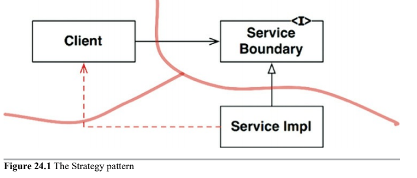
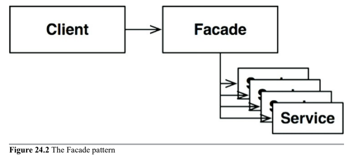

# Partial Boundaries

Full-fledged architectural boundaries are expensive. In many situations, a good architect might judge that the expense of such a boundary is too high, but might still want to hold a place for such a boundary in case it is needed later.

## Skip the last step

One way to construct a partial boundary is to do all the work necessary to create independently compilable and deployable components, and then simply keep them together in the same component.

## One-Dimensional Boundaries

Full-fledged architectural boundary uses reciprocal boundary interfaces to maintain isolation in both directions. Maintaining separation in both directions is expensive both in initial setup and in ongoing maintenance.

A simpler structure that serves to hold the place for later extension to a full-fledged boundary is shown next and its an example of the _Strategy design pattern_.

## Facades

An even simpler boundary is the _Facade design pattern_. In this case, even the dependency inversion is sacrificed. The boundary is simply defined by the `Facade` class, which lists all the services as methods, and deploys the service calls to classes that the client is not supposed to access.

---

# Conclusion

There are many approaches to partially implement an architectual boundary. Each is appropriate in certain context, as a placeholder for an eventual full-fledged boundary. Each can also be degraded if that boundary never materializes.