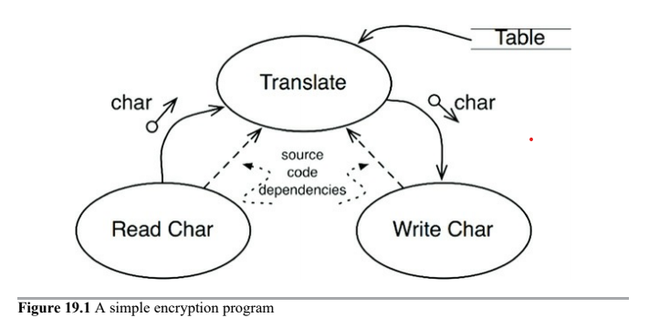
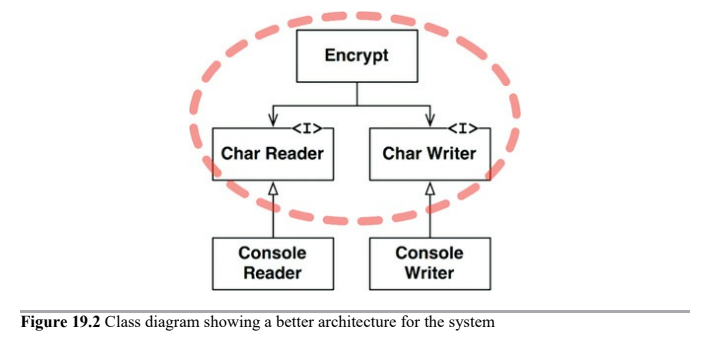

# Policy and Level

Software systems are statements of policy by which inputs are transformed into outputs.

In most nontrivial systems, that policy can be broken down into many smaller statements of policy. Part of the art of developing a software architecture is carefully __separating those policies__ from one another, and __regrouping them based on the ways that they change__.

The art of architecture often involves forming the regrouped components into a directed acyclic graph.

## Level

Level is _the distnace from the inputs and outputs_. The farther a policy is from both the inputs and the outputs of the system, the higher its level.

The policies that manage input and output are the lowest-level policies in the system.

The following data flow diagram depicts a simpyl encryption program that reads characters from an input devices, translates them using a table, and writes translated characters to an output device.



The `Translate` component is the highest-level component in this system because it is the component that is farthest from the inputs and outputs.

Note that the data flows and source code dependencies do not always point in the same direction. We want the __source code dependencies to be decoupled from data flow and coupled to level__.

It would by easy to create an incorrect architecture like this:

```
function encrypt() {
    while(true)
        writeChar(translate(readChar()));
}
```

This is incorrect architecture because the high-level `encrypt` function depends on the lower-level `readChar` and `writeChar` functions.

A better architecture will be as follow:



This structure decouples the high-level encryption policy from the lower-level input/output policies. This make encryption policy usable in a wide range of contexts. When changes are made to the input and output policies, they are not likely to affect the encryption policy. It is far more likely that the IO devices will change than the encryption algorithm will change.

---

# Conclusion

Policies involved a mixture of _Single Responsibility Principle, Open-Closed Principle, Common Closure Principle, Dependency Inversion Principle, Stable Dependencies Principle and Stable Abstractions Principle_.