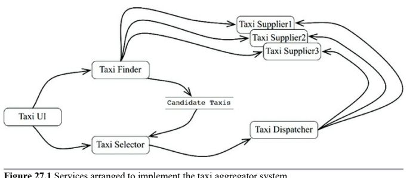
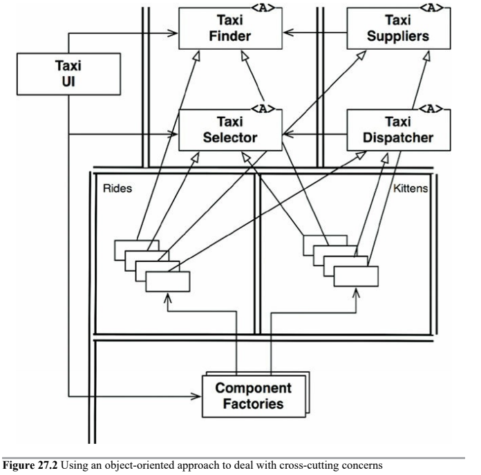
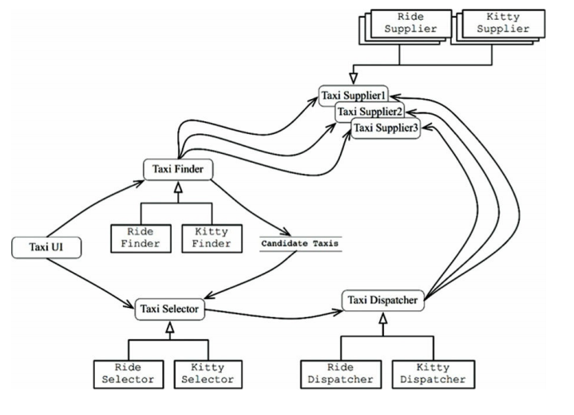

# Services

* Service _Partial_ Architecture
* Service _Partial_ Benefits
    * Decoupling Fallacy: Services seems to be strongly decoupled from each other
    * Independence fallacy: Services appear to support independence of development and deployment
* Component-based services
* Cross-cutting concerns

## Service Architecture

The architecture of a system is defined by boundaries that separate high-level policy from low-level detail, and follow the Dependency Rule. Services that simply separate application behaviors are little more than expensive function calls, and are not necessarily architecturally significant.

This is not to say that all services _should_ be architecturally significant. There are often substantial benefits to creaing services that separate functionality across processes and platforms, whether they obey the Dependency Rule or not.

Some services are architecturally significant, and some aren't.

## Service Benefits

* Decoupling fallacy
* Independent development/deployment fallacy

#### Decoupling Fallacy

Services are decoupled at the level of individual variables. After all, each service runs in different process, or even a different processor, therefore those services do not have access to each other's variables. However, they can still be coupled by shared resources within a processor, or on the network. What's more, they are strongly coupled by the data they share.

For example, if a new field is added to a data record that is passed between services, then every service that operates on the new field must be changed. The services must also strongly agree about the interpretation of the data in that field. Thus those services are strongly coupled to the data record and, therefore, indirectly coupled to each other.

Service interfaces are no more formal, no more rigorous, and no better defined than function interfaces.

#### Independent development/deployment fallacy

This independence of development and deployment is presumed to be _scalable_. History has shown that large enterprise systems can be built from monoliths and component-based systems as well as service-based systems. Thus services are not the only option for building scalable systems.

The decoupling fallacy means that services cannot always be independently developed, deployed and operated. To the extent that they are coupled by data or behavior, then development/deployment/operation must be coordinated.

## The Kitty Problem

Let's take as example a Taxi Aggregator System. This system knows about many taxi providers in a given city, and allows customers to order rides. Let's assume that the customers select taxis based on a number of criteria, such as pickup time, cost, luxury, etc.

We wanted our system to be scalable, so we chose to build it out of lots of little micro-services. We subdivided our development staff into many small teams, each of which is responsible for developing, maintaining, and operating a correspondingly small number of services.

The `TaxiUI` service deals with the customers, who use mobile devices to order taxis. The `TaxiFinder` service examines the inventories of the various `TaxiSuppliers` and determines which taxies are possible candidates for the user. It deposites these into a short-term data record attached to that user. The `TaxiSelector` service takes the user's criteria of cost, time, luxury, and so forth, and chooses an appropriate taxi from among the candidates. It hands that taxi off to the `TaxiDispatcher` service, which orders the appropriate taxi.

One bright and cheerful day, marking department announce their plancs to offer a kitten delivery service to the city. Users can order kittens to be delivered to their homes or their places of business.

The company will set up several kitten collection points across the city. When a kitten order is placed, a nearby taxi will be selected to cllect a kitten from one of those collection points, and then deliver it to the appropriate address.

Some drivers are likely to participate, others may decline. Also, some customers won't want to use a taxi that deliver kittens because of allergies or some other reason.

How many of those services will have to change to implement this feature? _All of them_. Clearly, the development and deployment of the kitten feature will have to be very carefully coordinated.

In other words, the services are all coupled, and cannot be independently developed, deployed and maintained.

## Objects to the Rescue

Careful consideration of the SOLID design principles would have prompted us to create a set of classes that could be polymorphically extended to handle new features.

Note the boundaries and dependencies of the following diagram.

Much of the logic of the original services is preserved within the base classes of the object model. However, that portion of the logic that was specific to _rides_ has been extracted into a _Rides_ component. The new feature for kittens has been placed into a _Kittens_ component. These two components override the abstract base class in the original components using a pattern such as _Template Method or Strategy_.

Note again that the two new components, _Rides_ and _Kittens_, follow the _Dependency Rule_. Note also that the classes that implement those features are created by factories under the control of the UI.

Clearly, in this scheme, when the Kitty feature is implemented, the `TaxiUI` must change. But nothing else needas to be changed. Thus the Kitty feature is decoupled, and independently developable and deployable.

## Component-Based Services

Services can also be designed using the SOLID principles, and given a component structure so that new components can be added to them without changing the existing components within the service.

The following service diagram shows the structure. The services still exist as before, but each has its own internal component design, allowing new features to be added as new derivative classes within their own components.

## Cross-Cutting Concerns

Architectural boundaries do not fall _between_ services. Rather, those boundaries run _through_ the services, dividing them into components.

To deal with the cross-cutting concerns that all significant systems face, services must be designed with internal component architectures that follow the Dependency Rule. Those services do not define the architectural boundaries of the system, instead, the components within the services do.

---

# Conclusion

As useful as services are to scalability and develop-ability of a system, they are not, in and of themselves, architecturally significant elements. The architecture of a system is defined by the boundaries drawn within that system, and by the dependencies that cross those boundaries.

The architecture is not defined by the phyisical mechanisms by which elements communicate and execute.

A service might be a single component, completely surrounded by an architectural boundary. Alternatively, a service might be composed of several components separated by architectural boundaries. In rare cases, clients and services may be so coupled as to have no architectural significance whatever.