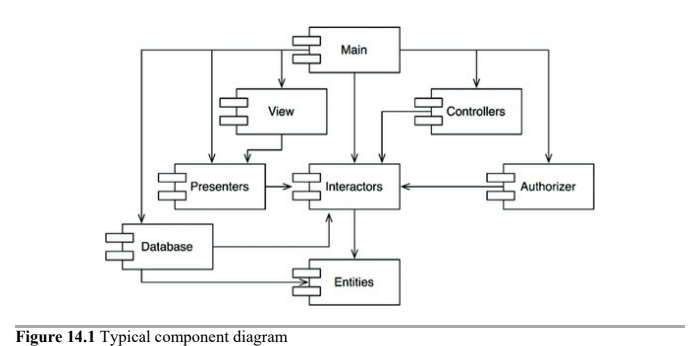
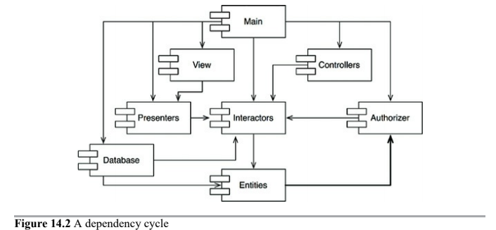
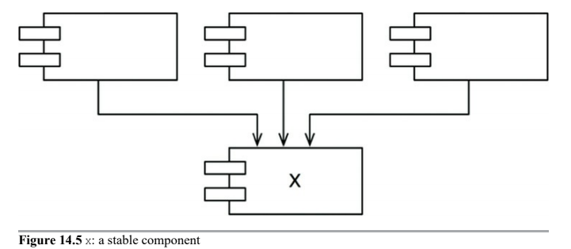
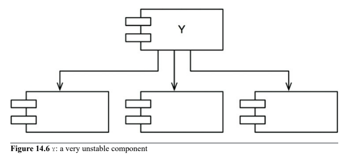
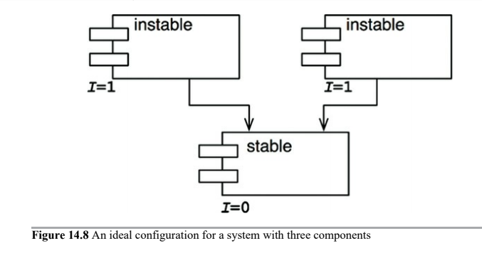
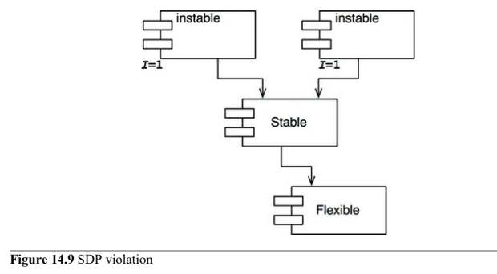
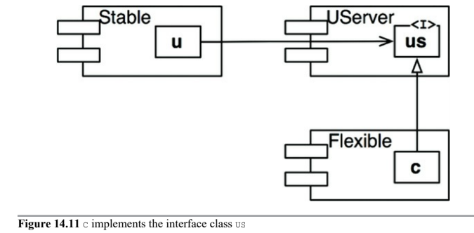
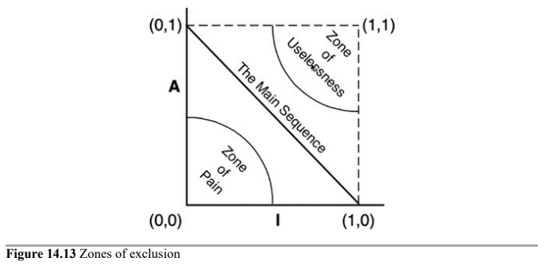

# Component Coupling

The next principles deal with the __relationships between components__.

Here again we will run into tension between develop-ability and logical design.

* ADP - Acyclic Dependencies Principle
* Top-Down Design
* SDP - Stable Dependencies Principle
* SAP - Stable Abstraction Principle
* The Main Sequence

## ADP - Acyclic Dependencies Principle

> Allow no cycles in the component dependency graph.

Avoiding the "_morning after syndrome_" where next morning you find that your stuff no longer works because somebody changed something you depend on.

Two solutions:
* Weekly Build
* DAG - Directed Acyclic Graph
    * Applying dependency inversion principle
    * Break dependency structure with new components

#### Weekly Build

All developers ignore each other for the first four days of the week, working on private copies of the code and don't worry about integrating on collective bases. Then, on Friday, they integrate all their changes and build the system.

As project grows, it becomes less feasible to finish integrating the project on Friday. Integration burden grows until it starts to overflow into Staruday, and so on.

As the duty cycle of development versus integration decreases, the efficiency of the team decreases too. The build schedule has to be continually lengthened (increasing project risks). Integration and testing become intcreasingly harder to do, and the team loses the benefit of rapid feedback.

#### Eliminating Dependency Cycles - Directed Acyclic Graph

Solution to Weekly Build's problems is partition the development environment into releasable components. Components become units of works, that are released for use by others.

As new releases of a component are made available, other teams can decide whether they will immediately adopt the new release. 

Thus no team is at the mercy of the others. Changes made to one component do not need to have an immediate affect on other teams. Moreover, _integrations happens in small increments_.

To make it work successfully, you __must manage the dependency structure__ of the components. __There can be no cycles__.

Consider the following component diagram, it shows a rather typical structure of components assembled into an application. Notice that the structure is a _directed graph_. The components are the _nodes_ and the dependency relationships are the _directed edges_.

Regardless of which component you begin at, it is impossible to fllow the dependency relationships and wind up back at that component. This structure has no cycles. It is a __directed acyclic graph (DAG)__.

Now consider what happens then the team responsible for `Presenters` makes a new release of their components. It is easy to find out who is affected by this release, you just follow the dependency arrows backward (`View` and `Main`).

Notice also that when `Main` is released, it has utterly no effect on any of the other components in the system. They don't know about `Main`, and they don't care when it changes. This is nice.

When the developers working on the `Presenters` component would like to run a test of that component, they just need to build their version of `Presenters` with the versions of the `Interactors` and `Entities` they are currently using. None of the other components in the system need to be involved.

When it is time to release the whole system, the process proceeds from __the bottom up__.

#### Effect of a Cycle in the component dendency graph

Suppose a new requirement forces us to change one of the classes in `Entities` such that it makes use of a class in `Authorizer`.

This cycle creates some immediate problems. `Database` component must be compatible with `Entities`. However, with the cycle in place, it must _also_ be compatible with `Authorizer`. This makes `Database` more difficult to release.

This makes `Entities`, `Authorizer` and `Interactors` have become one large component. They will be stepping all over one another because they must all use exxactly the same release of one another's components.

Such cycles make it very difficult to isolate components. Unit testing and releasing become very difficult and error prone.

Morever, when there are cycles in the dependency graph, it can be __very difficult to work out the order in which you must build the components__. Indeed, there probably is no correct order.

#### Breaking the Cycle

1. __Apply the Dependency Inversion Principle (DIP)__

In our example, we could create an interface that has the methods that `User` needs. We could then put that interface into `Entities` and inherit it into `Authorizer`. This inverts the dependency between `Entities` and `Authoorizer`, thereby _breaking the cycle_.

2. __Create a new component that both `Entities` and `Authorizer` depend on__

Move the class(es) that they both depend on into that new component.

#### The "Jitters"

The __second solution implies__ that the component structure is __volatile in the presence of changing requirements__. Indeed, as application grows, the component dependency structure jitters and grows. Thus the dependency structure must always be monitored for cycles and broken somehow.

---

## Top-Down Design

> Component structure cannot be designed from the top down.

Component structure evolves as the system grows and changes.

Component dependency diagrams have __very little to do with describing the function of the application__. Instead they are a __map to the _buildability_ and _maintainability_ of the application__.

As more modules accumulate in the early stages of implementation and design, there is a growing need to manage the dependencies so that the project can be developed without the "_morning after syndrome_". Moreover, we want to __keep changes as localized as possible__, so we start paying attention to the _Single Responsability Principle_ and _Common Closure Principle_ and collocate classes that are likely to change together.

We want the __isolation of volatility__. We don't want components that change frequently and for capricious reasons to affect components that otherwise ought to be stable. For example, we don't want cosmetic changes to the GUI to have an impact on our business rules.

Consequently, the __component dependency graph is created and molded by architects to protect stable high-value components from volatile components__.

As the application continues to grow, we start to become more concerned about creating reusable elements. At this point, the _Common Reuse Principle__ begins to influence the composition of the components. Finally, as a cycle appear, the _Acyclic Dependencies Principle_ is applied and the component dependency graph jitters and grows.

#### Design classes first

If we tried to design the component dependency structure before we designed any classes, we would likely fail rather badly. We would not know much about common closure, we would be unaware of any reusable elements, and we would almost certainly create components that produced dependency cycles. Thus the dependency structure grows and evolves with the logical design of the system.

---

## SDP - Stable Dependencies Principle

> Depend in the direction of stability

Designs cannot be completely static. Some volatility is necessary if the design os to be maintained. By conforming to the _Common Closure Principle_ we create components that are sensitive to certain kinds of changes but immune to others. We _expect_ them to change.

__Any component that we expect to be volatile, should not depend on by a component that is difficult to change__.

#### Stability

Stability is related to the amount of work required to make a change.

__One sure way to make a software component dificult to change, is to make lots of other software components depend on it__.

A component with lots of incoming dependencies is very stable, because it required a great deal of work to reconcile any changes with all the dependent components.

Let's see the given diagram.

It shows `x`, which is a stable component. Three components depend on `x` so it has three good reasons not to change. We say that `x` is _responsible_ to those three components. Conversely, x depends on nothing, so it has no external influence to make it change. We say it is _independent_.

Let's see the next diagram:

No other components depend on `y`, so we say that is _irresponsible_. `y` also has three components that it depends on, so changes may come from three external sources. We say that `y` is _dependent_.

#### Stability Metrics

We can count the number of dependencies that enter and leave that component. These counts will allow us to calculate the __positional stability__ of the component.

* _Fan-in_: classes outside the component that depend on classes within the component
* _Fan-out_: classes inside the component that depend on classes outside the component
* __I__: Instability: `Fan-out / (Fan-it + Fan-out)`. `0` indicates a maximally stable component, where `1` indicates a maximally unstable component.

__SDP Says that the `I` metric of a component should be larger than the `I` metrics of the components than it depends on__. That is, __`I` metrics should _decrease_ in the direction of dependency__.

#### Not all components should be stable

We don't want the system to be unchangeable.

The changeable components should depend on the stable components. Putting the unstable components at the top of the diagram is a useful convention because any arrow that points up is violating the SDP.

#### Abstract Components

We can create components that contains nothing but an interface, to break SDP violations. These abstract components are very stable and, therefore, ideal targets for less table components to depend on.

This is very common and necessary in statically typed languages like Java and C#, but don't exist at all using dynamically typed languages like Ruby and Python, because dependency inversion does not require either the declaration or the inheritance of interfaces.

---

## SAP - Stable Abstraction Principle

> A component should be as abstract as it is stable.

#### Where do we put the high-level policy?

Some software in the system __should not change very often__. This software represents __high-level architecture and policy decisions__. We don't want these business and architectural decisions to be volatile.

Thus, the software that encapsulates the high-level policies of the system should be placed into stable components (`I = 0`). Unstable components should contian software that we want to be able to quickly and easily change.

However, if the high-level policies are placed into stable components, then the source code that represents those policies will be difficult to change and could make the overall architecture inflexible.

__How can a component that is maximally stable be flexible enough to withstand change__? The answer is found in the _Open-Closed Principle_. It is possible and desirable to create classes that are flexible enough to be extended without requiring modification (__Abstract Classes__).

#### Introducing SAP

SAP sets up a relationship between stability and abstractness. A stable component should also be abstract so that __its stability does not prevent it from being extended__. On the other hand, it says that an unstable component should be concrete since its instability allows the concrete code within it to be easily changed.

Thus, __if a component is to be stable, it should consist of interfaces and abstract classes so that it can be extended__.

The _Stable Abstraction Principle_ and _Stable Dependency Principle_ combined amount to the _Dependency Inversion Principle_ for components. SDP says that dependencies should run in the direction of stability, and SAP says that stability implies abstraction. Thus __dependencies run in the direction of abstraction__.

#### Measuring Abstraction

The `A` metric is a measure of the abstractness of a component.

* `Nc`: classes in the component
* `Na`: abstract classes and interfaces in the component
* `A`: `A = Na / Nc`, goes from 0 to 1. 0 implies no abstract classes at all, 1 implies nothing but abstract classes.

---

## The Main Sequence

* Maximally stable and abstract components are at the upper left (0,1).
* Maximally unstable and concrete components are at lower right (1,0).

There is a locus of points on the `A/I` graph that defines reasonable poisition for components. We can infer what that locus is by __finding areas where components should _not_ be__, by determining the __zones of exclusion__.

#### Zone of Pain

Consider a component in the area of (0,0), highly stable and concrete. It cannot be extended because it is not abstract, and it is very difficult to change because of its stability.

Some software entities do, in fact, fall within the Zone of Pain. For example, _database schemas_.

#### Zone of Uselessness

Consider a component near (1,1). Maximally abstract, yet has no dependents.

Usually leftover abstract classes that no one ever implemented.

#### Distance from Main Sequence

`D = |A + I - 1|`. The range of this metric is [0, 1]. A value of 0 indicates the component is directly on the Main Sequence.

Given this metric, a design can be analyzed for its overall conformance to the Main Sequence.

---

# Conclusion

The _dependency management metrics_ described in this chapter measure the __conformance of a design__ to a pattern of __dependency and abstraction__.