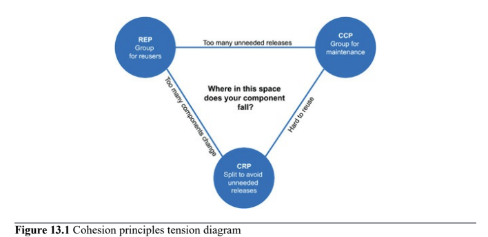

# Components Cohesion

Which classes belong in which components?

* __REP__: Reuse/Release Equivalence Principle
* __CCP__: Common Closure Principle
* __CRP__: Common Reuse Principle

## REP - Reuse/Release Equivalence Principle

> The granule of reuse is the granule of release.

People who want to reuse software components cannot, and will not, do so unless those components are tracked through a release process and are given release numbers.

__Without release numbers__ there would be __no way to ensure that all the reused components are compatible with each other__. It also reflects the fact that software developers need to know when new releases are coming, and which changes those new releases will bring.

From and architecture point of view, this principle means that the classes and modules that are formed into a component must belong to a cohesive group. __There must be some oeverarching theme or purpose that those modules all share__.

__Classes and modules that are grouped together into a component, should be _releasable_ together__. The fact that they share the same version number and the same release tracking, and are included under the same release documentation, should make sense both to the author and to the users.

---

## CCP - Common Closure Principle

> Gather into components those classes that change for the same reasons and at the same times. Separate into different components those classes that change at different times and for different reasons.

This is the _Single Responsibility Principle_ restated for components. A _class_ should not contain multiple reasons to change. So CPP says that __a component should not have multiple reasons to change__.

For mosst applications, maintainability is more important than reusability. If the code in an application must change, you would rather that _all of the changes occur in one component_.

This principle is also closely associated with the _Open Closed Principle (OCP)_. Because 100% closure is not attainable, closue must be strategic. We design our classes such that they are closed to the most common kinds of changes that we expect or have experienced.

CCP amplifies this lesson by gathering together into the same component those clases that are closed to the same type of changes. Thus, when a change in requirements comes along, _that changes has a good chance of being restricted to a minimal number of components_.

#### Similarity with SRP

CCP is the component form of the SRP.

Gather together those things that change at the same times and for the same reasons. Separate those things that change at different times or for different reasons.

---

## CRP - Common Reuse Principle

> Don't force users of a component to depend on things they don't need.

CRP is yet another principle that helps us to decide which classes and modules should be placed into a component. It states that __classes and modules that tend to be reused together belong in the same component__.

Typically, reusable classes collaborate with other classes that are part of the reusable abstraction. The CRP states that these classes belong together in the same component. In such a component, we would expect to see classes that have lots of dependencies on each other.

A simple example might be a container class and its associated iterators. These classes are reused together because they are tightly coupled to each other. Thus they ought to be in the same component.

CRP also tells us which classes _not_ to keep together in a component. When one component uses another, a dependency is created between the components. Perhaps the _using_ component uses only one class within the _used_ component, but that still doesn't weakn the dependency. The _using_ component still depends on the _used_ component. Because of that dependency, every time the _used_ component is changed, the _using_ component will likely need corresponding changes, even if no changes are necessary, it will likely still need to be recompiled, revalidoated, and redeployed.

Thus when we depend on a component, we want to make sure we depend on every class in that component. Put another way, we want to make sure that __the classes that we put into a component are inseparable__, that is imposible to depend on some and not on the others. Otherwise, we will be redeploying more components than is necessary.

CRP tells us more about __which classes shouldn't be together__ than about which classes should be together. __Classes that are not tightly bound to each other should not be bound in the same component__.

#### Relation to Interface Segregation Principle

The CRP is the generic version of the ISP.

__Don't depend on things you don't need__.

---

## The Tension Diagram for Component Cohesion

The three cohesion principles tend to fight each other. The REP and CCP are _inclusive_ principles. Both tend to make components larger. The CRP is an _exclusive_ principle, diriving components to be smaller. It is the tension between these principles that good architects seek to resolve.

The edges of the following diagram describe the _cost_ of abandoning the principle on the opposite vertex.

A good architect finds a position in that tension triangle that __meets the current concerns of the development team__, but is also aware that __those concerns will change over time__.

For example, early in the development of a project, CCP is much more important than REP, because develop-ability is more important than reuse. Generally, projects tend to start on the right hand side of the triangle, where the only sacrifice is reuse. As project matures, it will slide over to the left. __It has more to do with the way that project is developed and used, than with what the project actually does__.

---

# Conclusion

Today we have a much more complex variety of cohesion that a module performs one, and only one, function. In choosing the classes to group together into components, we must consider the opposing forces involved in reusability and develop-ability. Balancing these forces with the needs of the application is nontrivial. Moreover, the balance is almost always dynamic.