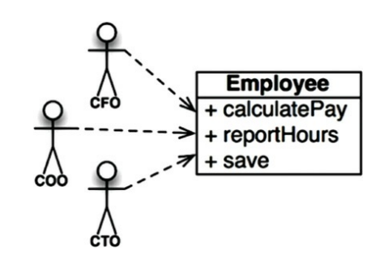
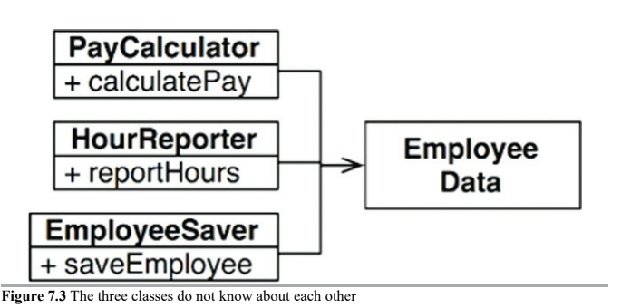
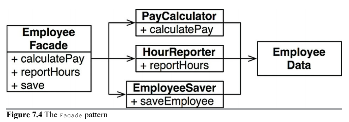
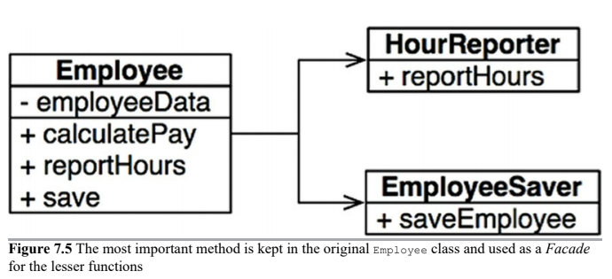

# SRP: Single Responsibility

This principle is usually mistaken with another principle that is not one of the SOLID principles:

> A function should do one, and only one, thing.

Software systems are changed to satisfy user and stakeholders, those are the "_reason to change_". We'll refer to those groups as an _actor_.

Thus the final version of the SRP is:

> A module should be __responsible to one, and only one, actor_.

The simplest definition of __module__ is just a source file, which means a cohesive set of functions and data structures. Cohesion is the force that binds together the code responsible to a single actor.

Symptoms of violating SRP:

* Accidental Duplication
* Merges
* Others

### Accidental Duplication

This `Employee` class violates the SRP because those three methods are responsible to three very different actors.

* `calculatePay()` method is specified by the accounting department, which reports to the CFO.
* `reportHours()` method is specified and used by the human resources department, which reports to the COO.
* `save()` method is specified by the database administrators (DBAs), who report to the CTO.

By putting the source code for these three methods into a single `Employee` class, the developers have coupled each of these actors to the others. This coupling can cause the actions of the CFO's team to affect something that the COO's team depends on.

For example, suppose that the `calculatePay()` function and the `reportHours()` function share a common algorithm for calculating non-overtime hours. Suppose also that the developers, who are careful not to duplicate code, put that algorithm into a function named `regularHours()`.

Now suppose that the CFO's team decides that the way non-overtime hours are calculated needs to be tweaked. In contrast, the COO's team in HR does not want that particular tweak because they use non-overtime hours for a different purpose.

A developer is tasked to make the change, and sees the convenient `regularHours()` function called by the `calculatePay()` method. Unfortunately, the developer does not notice that the function is also called by the `reportHours()` function.

The required change is tested. CFO's team validates the new function and system is deployed.

Of course, the COO's team doesn't know that this is hapenning. Eventually this problem is discovered, and the COO is livid because bad data has cost his budget millions of dollars.

These problems occur because we __put code that different actors depend on into close proximity__. The SRP says to __separate the code that different actors depend on__.

### Merges

It's not hard to imagine that merges will be common in source files that contain many different methods. This situation is especially likely if those methods are responsible to different actors.

For example, suppose that the CTO's team of DBAs decide that there should be a simple schema change to the `Employee` table of the database. Suppose also that the COO's team of HR clerks decides that they need a change in the format of the hours report.

Two different developers, possibly from two different teams, check out the `Employee` class and begin to make changes. Unfortunately their changes collide. The result is a merge.

The merge puts both the CTO and COO at risk.

### Other symptoms

There are many other symptoms that we could investigate, but they all involve multiple people changing the same source file for different reasons.

Once again, the way to avoid this problem is to __separate the code that supports different actors__.

---

## The Solution

There are many solutions to these problems. Each moves the functions into different classes.

Perhaps the most obvious way to solve the problem is to __separate the data from the functions__. 

In our example, the three classes share access to `EmployeeData`, which is a simple data structure with no methods. Each class holds only the source code necessary for its particular function. The three classes are not allowed to know about each other. Thus accidental duplication is avoided.

The downside of this solution is that developers now have three classes that they have to instantiate and track. A common solution to this dilemma is to use the __Facade__ pattern.

The `EmployeeFacade` contains very little code. It is responsible for instantiating and delegating to the classes with the functions.

Some developers prefer to keep the most important business rules closer to the data. This can be done by keeping the most important method in the original `Employee` class and then using that class as a _Facade_ for the lesser functions.

The number of functions required to calculate pay, generate a report, or save the data is likely to be large in each case. Each of those clases would have many _private_ methods in them. Each of the classes that contain such a family of method is a __scope__. Outside of that scope, no one knows that the private members of that family exist.

---

# Conclusion

The Single Responsibility Principle is about __functions and classes__, BUT it reappears in a different form at two more levels:

* Components level - __Common Closure Principle__
* Architectural level - __Axis of Change__ responsible for the creation of _Architectural Boundaries_
