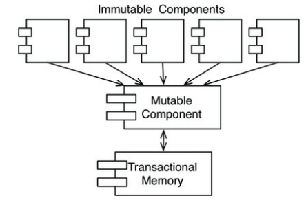

# Functional Programming

This paradigm is strongly based on the [Lambda Calculus](https://en.wikipedia.org/wiki/Lambda_calculus) invented by Alonzo Church in the 1930s. In many ways, its concepts predate programming itself.

## Immutability and Architecture

All race conditions, deadlock conditions, and concurrent update problems are due to _mutable variables_. All the problems that we face in concurrent applications (multiple threads/processors) cannot happen if there are no mutable variables.

As an architect, you should be vay interested in issues of concurrency. You want to make sure that the systems you design will be robust in the presence of multiple threads and processors.

But, is immutability practicable? It is if you have infinite storage and infinite processor speed. Lacking those infinite resources, certain compromises are made.

* Segregation of Mutability
* Event Sourcing

---

## Segregation of Mutability

> Segregate into componantes that do not mutate variables and those that do.

Segregate the services within the application into mutable and immutable components. The immutable components perform their tasks in a purely functional way, without using any mutable variables, and communicate with one ore more other componentes that are not purely functional, allowing for the state of variables to be mutated.

Since mutating state exposes those components to all the problems of concurrency, it is common practice to use some kind of _transactional memory_ to protect the mutable variables from concurrent updates and race conditions.

Transactional memory simply treats variables in memory the same way a database. iot protects those variables with a transaction- or retry-based schemes.

Architects would be wise to __push as much processing as possible into the immutable components__, and to __drive as much code as possible out of those components that allow mutation__.

## Event Sourcing

Perhaps we haver enough storage and processing power to not require mutable variables for the reasonable lifetime of an application.

Event sourcing is a __strategy wherein we store the transactions, but not the state__. When state is required, we simply apply all the transactions from the beginning of time.

Of course, we can take shortcuts. For example, we can compute and save the state every midnight. Then, when the state information is required, we need compute only the transactions since midnight.

In this scheme, nothing gets deleted or updated from data store, thus, there cannot be any concurrent update issues.

---

# Conclusion

If we have enough storage and enough processor power, we can make our applications entirely immutable, and therefore, entirely functional. If this sounds absurd, it might help if you remembered that this is precisely the way your source code control system works.

All the problems we face in concurrent applications, cannot happen if there are no mutable variables.